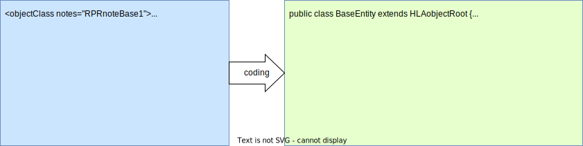

# Encoding Helper

## Background

All interactions and object updates are encoded and decoded by HLA-Encoders obtained from the RTI-EncoderFactory. The interaction parameters and object attributes are structured according to the OMT definitions. Before sending the data must be encoded into a handle value map and after receiving the data must decoded into basic Java data types. With that concept, the protocol data units (PDU) are only containing encoded byte arrays.  

The [HLA standard](encoding-hla.md) provides encoding factories to support the decoding and encoding of transmitted data. However, the object and interaction classes defined in OMT files, along with the included data types, must be managed by the federation developer. As these classes and data types can become quite complex, the construction of the encoding helpers can become a challenge as well. This is the point where OMT helper classes become useful, as they can ensure that the object is constructed consistently, and it can provide a clear separation between the construction process and the representation of the object.


## OMT Helper Classes

The implementation approach of the helper classes is to provide a base class for the different OMT elements, like the `HLAobjectRoot`, to provide the common logic for all derived elements, like a subclass `BaseEntity`. The basic idea is to provide all generic functionality within the common superclass, and to use the derived subclasses to provide *type-save* wrappers for accessing the defined attributes and parameters. The goal is to create one Java class for each OMT object and interaction class. The figure below illustrates this for some object class examples. 


The helper class will be specific for a particular parameter or attribute and will provide Java type save getter and setter methods. For example a OMT object class *BaseEntity* would be represented on a Java class *BaseEntity*. A typed attribute *EntityType* would be used typed setter and getter methods, like *setEntityType* and *getEntityType*. The attribute data structure would be represented by a helper class 'EntityTypeStruct*.



## Example Usage 

The resulting helper class *BaseEntity* could then be used as shown in the example below. After initializing the framework, a instance of *BaseEntity* will be created by the default constructor. This instance can now be used to setup the subscription and publication policy. In the example below, the attributes *EntityType* and *EntityIdentifier* shall be published. At this point the object has no connection to an RTI. Only after calling the *register* method, the *rtiAmbassador* will be informed about publications and the object instance will be registered. 

By using the setter methods, the local attributes of the helper object can be prepared for update. These setter and also the getter methods are only local calls to the helper instance. After providing new values some attributes, the *update* method will send the updates to the *rtiAmbassador*.  

The helper class framework does not regulate which attributes must updated together or the order of successive updates. This must be done according to the federation agreements. 

```java
// Initialize the Helper Classes
HLAroot.initialize(rtiAmbassador);
// Create typed instance helper 
BaseEntity base1 = new BaseEntity();
base1.publishEntityType();
base1.publishEntityIdentifier();
base1.register();
// use getter and setter to work with attributes
base1.getEntityIdentifier().setEntityNumber((short) 1);
base1.getEntityIdentifier().getFederateIdentifier().setApplicationID((short) 2);
base1.getEntityIdentifier().getFederateIdentifier().setSiteID((short) 3);
base1.getEntityType().setEntityKind((byte) 0x1);
// send all changed attributes to the rti ambassador 
base1.update()
```

On the receiver side, the helper classes allow the construction of a type save proxy object by decoding the received _AttributeHandleValueMap theAttributes_. 

```java
BaseEntity recvEntity = new BaseEntity();
recvEntity.decode(theAttributes);
short n = recvEntity.getEntityIdentifier().getEntityNumber();
```

The support of attribute structures is discussed on the [encoding-struct](encoding-struct.md) section. 

> **NOTE:** Please note that the _subscribeEntityType_ method is currently defined as a instance method, and not as a class method. This is because in Java class methods (static methods) can not be overwritten by inherited methods. Or in other words, static methods are not polymorphic. However, the published attributes are inherited on several levels and the helper functions need work on all inheritance layers. 

