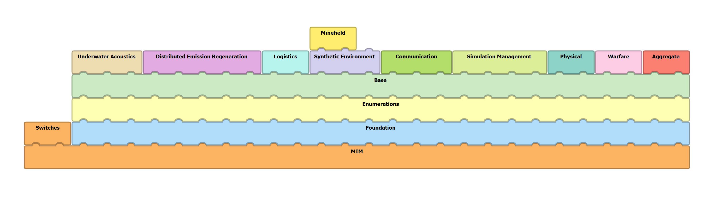

# RPR FOM Interoperability Requirements

The Real-time Platform Reference Federation Object Model (RPR FOM) is a collection of object and interaction classes for the High Level Architecture (HLA), designed to link simulations of discrete physical entities into complex virtual world [RPR FOM 2.0](https://www.sisostds.org/DigitalLibrary.aspx?Command=Core_Download&EntryId=30822).

The modules in the RPR FOM are structured into a list modules dedicated for different functional areas. All functional modules are based on three generic modules, building the common definitions. The base modules are:

- Foundation
- Switches
- Enumeration
- [Base](rpr-entity.md)

The functional modules are:

- [Aggregate](rpr-aggregate.md)
- [Communication](rpr-communication.md) 
- Underwater Acoustics 
- Simulation Management 
- [Warfare](rpr-warfare.md)
- [Physical](rpr-physical.md)
- Synthetic Environment 
- Logistics 
- [Distributed Emission Regeneration](rpr-der.md)

The dependencies between these modules are shown in the following figure:

The [Object Classes](object-classes.md) and [Interaction Classes](interaction-classes.md) are defined in these modules.
