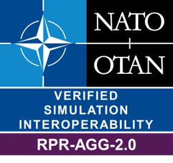

# RPR FOM Aggregate Module Badge

Interoperability Requirements for the RPR FOM Aggregate Module (see also [JSON definition file](badges/RPR-AGG-2.0.json)). 

| Short&nbsp;Name&nbsp;&nbsp;&nbsp;&nbsp;&nbsp;&nbsp;&nbsp;&nbsp;&nbsp;&nbsp; | Description |
| ---------- | ----------- |
| IR-RPR2-0001 | SuT shall comply with SISO-STD-001-2015, Standard for Guidance, Rationale, and Interoperability Modalities for the Real-time Platform Reference Federation Object Model, Version 2.0, 10 August 2015 |
| IR-RPR2-0002 | SuT shall define BaseEntity.AggregateEntity as published or define a subclass of BaseEntity.AggregateEntity as published and/or define BaseEntity.AggregateEntity as subscribed in CS/SOM. |
| IR-RPR2-0003 | SuT shall update the following required attributes for AggregateEntity object instances registered by SuT: AggregateState, Dimensions, EntityIdentifier, EntityType, Spatial. |
| IR-RPR2-0004 | SuT shall assume default values for optional attributes on instances of AggregateEntity object class. |
| IR-RPR2-0005 | SuT shall assume default values for optional attributes on instances of AggregateEntity object class. |
| IR-RPR2-0006 | SuT shall not rely on updates of optional attributes on instances of AggregateEntity object class. |
| IR-RPR2-0007 | SuT shall be configurable for the following parameters: SiteID, ApplicationID. |

