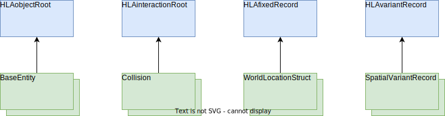

# Encoding Helper

## Background

All interactions and object updates are encoded and decoded by HLA-Encoders obtained from the RTI-EncoderFactory. The interaction parameters and object attributes are structured according to the OMT definitions. Before sending the data must be encoded into a handle value map and after receiving the data must decoded into basic Java data types. With that concept, the protocol data units (PDU) are only containing encoded byte arrays.  

The HLA standard provides encoding factories to support the decoding and encoding of transmitted data. However, the object and interaction classes defined in OMT files, along with the included data types, must be managed by the federation developer. As these classes and data types can become quite complex, the construction of the encoding helpers can become a challenge as well. This is the point where OMT helper classes become useful, as they can ensure that the object is constructed consistently, and it can provide a clear separation between the construction process and the representation of the object.

## HLA Helper Classes for Encoding and Decoding

Steps to send and receive an interaction:

### Phase 1: Publishing

1. Get the interaction handle: `_messageId = rtiAmbassador.getInteractionClassHandle("Communication")`
2. Get the parameter handles: `_parameterIdText = rtiAmbassador.getParameterHandle(_messageId, "Message")`

### Phase 2: Encoding

3. Create parameter handle value map: `parameters = rtiAmbassador.getParameterHandleValueMapFactory().create(1)`
4. Create encoder: `messageEncoder = _encoderFactory.createHLAunicodeString()`
5. Set the value: `messageEncoder.setValue(_message)`
6. Encode the value: `parameters.put(_parameterIdText, messageEncoder.toByteArray())`
7. Send the interaction: `rtiAmbassador.sendInteraction(_messageId, parameters, null)`

### Phase 3: Receive and Decode

8. Receive the interaction: `receiveInteraction` callback
9. Iterate through received parameter handle value map: `theParameters.keySet().iterator()`
10. Create the correct encoder: `_encoderFactory.createHLAunicodeString()` 
11. Decode the message: `messageDecoder.decode((byte[]) theParameters.get(handle))`
12. Read the as basic Java type: `message = messageDecoder.getValue()`

The alignment between the attribute names and the correct encoders is important in these steps. The OMT definitions must be maintained while selecting the correct encoder types. This can get quite complex, especially when using structured elements for the parameters or attributes.
In order to support type safe programming, the RPR Builder provides helper classes for the parameter and attribute structures. 

## OMT Helper Classes

The OMT helper classed are following the **Builder** Design Pattern. The Builder Pattern ensures that the object being constructed is consistent by:

1. Defining a clear set of steps for building the object,
2. Providing a way to enforce the order in which the steps are performed,
3. Allowing only valid combinations of options to be used to build the object,
4. Ensuring that all required information is provided before the object is built.

The implementation approach of the helper classed is to provide a base class for the different OMT elements, like the `HLAobjectRoot`, to provide the common logic for all derived elements, like a subclass `BaseEntity`. From these base helper classed the federation developer may derive subclasses, that allows the a *type save* manipulation of federation specific OMT elements.

The helper class will be specific for a particular parameter or attribute and will provide Java type save getter and setter methods. 
