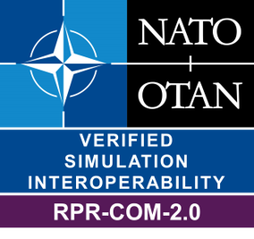

# RPR FOM Communication Module Badge

Interoperability Requirements for the RPR FOM Communication Module. 

| Short&nbsp;Name&nbsp;&nbsp;&nbsp;&nbsp;&nbsp;&nbsp;&nbsp;&nbsp;&nbsp;&nbsp;&nbsp; | Description |
| ---------- | ----------- |
| IR-RPR-COM-0001 | Each SuT updating instance attributes of the RadioTransmitter class or its subclasses shall provide the state/identification fields RadioIndex, RadioSystemType, and TransmitterOperationalStatus. |
| IR-RPR-COM-0002 | Each SuT updating instance attributes of the RadioTransmitter class or its subclasses shall guarantee that a unique RadioIndex / HostObjectIdentifier combination is provided for each radio instance. The one remaining state/identification field, RadioInputSource, shall be treated as an optional field. |
| IR-RPR-COM-0003 | All of the electromagnetic characteristics shall be provided by each SuT updating instance attributes of the RadioTransmitter class or its subclasses except AntennaPatternData, which is only required for non-OmniDirectional pattern types. |
| IR-RPR-COM-0004 | The attributes Frequency and FrequencyBandwidth shall be updated together. |
| IR-RPR-COM-0005 | All of the modulation, and cryptography attributes shall be treated as optional fields by SuTs updating instance attributes of the RadioTransmitter class or its subclasses. |
| IR-RPR-COM-0006 | The StreamTag identifies a real-time audio stream. When this stream is transmitted using a series of EncodedAudioRadioSignal interactions, they shall all use the same StreamTag. Conversely all signal interactions with the same StreamTag compose the same stream. This StreamTag shall be different from all other StreamTags in use at that time. A real-time audio stream shall be associated with one or more RadioTransmitter instance objects. The StreamTag attribute of the RadioTransmitter object class shall identify its associated real-time audio stream. |
| IR-RPR-COM-0007 | StreamTag shall be unique across the federation execution. |
| IR-RPR-COM-0008 | If the associated RadioTransmitter Object is "On and Transmitting" and there are no associated EncodedAudioRadioSignal interactions, then the receiver shall be receiving an unmodulated carrier. |
| IR-RPR-COM-0009 | A single stream should be used to represent identical audio signals transmitted simultaneously by multiple transmitters. This single stream shall be identified by the use of the same StreamTag value in each RadioTransmitter Object. |
| IR-RPR-COM-0010 | As per the DIS standard, the site, application, entity (SAE) triplet of numbers shall identify a valid host vehicle (DIS Entity State PDU) to which this radio is attached. |
| IR-RPR-COM-0011 | Each SuT updating instance attributes of the RadioReceiver class or its subclasses shall always provide the RadioIndex and ReceiverOperationalStatus. |
| IR-RPR-COM-0012 | Each SuT updating instance attributes of the RadioReceiver class or its subclasses shall guarantee that a unique RadioIndex / HostObjectIdentifier combination is provided for each radio instance. The remaining parameters shall also be provided whenever the radio is in a receiving state. |
| IR-RPR-COM-1001 | The RadioSignal interaction does not contain any state information however. Instead the RadioSignal interaction shall point back to the RadioTransmitter object. |
| IR-RPR-COM-1002 | HostRadioIndex and StreamTags, shall be globally unique. |
| IR-RPR-COM-1003 | Senders of RadioSignal Intraction interaction class shall provide values for all parameters; there are no optional fields. |
| IR-RPR-COM-1004 | The values for TacticalDataLinkType and TDLMessageCount shall default to “other” and “zero” respectively. The sender shall provide all other parameters. |
