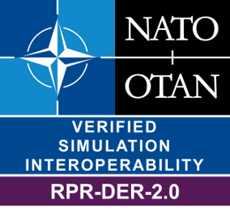

# RPR FOM Distributed Emission Regeneration Module Badge

Interoperability Requirements for the RPR FOM Distributed Emission Regeneration Module. Badge short name **RPR-DER-2.0**, current version 0.1 (see also [JSON definition file](badges/RPR-DER-2.0.json)).

| Short&nbsp;Name&nbsp;&nbsp;&nbsp;&nbsp;&nbsp;&nbsp;&nbsp;&nbsp;&nbsp;&nbsp; | Description |
| ---------- | ----------- |
| IR-RPR-DER-0001| If a SuT updating instance attributes of the Designator object class or its subclasses does not supply the DesignatedObjectIdentifier attribute, the default behavior shall treat the designator as if it was not located on an entity |
| IR-RPR-DER-0002| The DesignatedObjectIdentifier, DeadReckoningAlgorithm, RelativeSpotLocation, and SpotLinearAccelerationVector shall be treated as optional fields. All other attributes in Table 55 in [SISO-STD-001-2015] are mandatory and shall be provided by federates updating instance attributes of this object class or its subclasses |
| IR-RPR-DER-0003| The EmitterSystem object class has no optional attributes; federates updating instance attributes of this object class or its subclasses shall provide all of the attributes specified in Table 56 [SISO-STD-001-2015] |
| IR-RPR-DER-0004| Each federate updating an instance of the IFF object class or its subclasses shall always provide the EventIdentifier, Layer2DataAvailable, SystemName, SystemType, SystemOn, SystemIsOperational, and SystemMode attributes. If the Layer2DataAvailable attribute is set to true, then the BeamAzimuthCenter, BeamAzimuthSweep, BeamElevationCenter, BeamElevationSweep, BeamSweepSync, FundamentalParameterData, SecondaryOperationalDataParameter1, and SecondaryOperationalDataParameter2 shall be provided |
| IR-RPR-DER-0005| The NatoIFF object class has no optional attributes, federates updating an instance of this object class or its subclasses shall provide all of the attributes specified in Table 58 [SISO-STD-001-2015] |
| IR-RPR-DER-0006| The NatoIFFTransponder object class has no optional attributes, federates updating an instance of this object class or its subclasses shall provide all of the attributes specified in Table 59 [SISO-STD-001-2015] |
| IR-RPR-DER-0007| The SovietIFF object class has no optional attributes, federates updating an instance of this object class or its subclasses shall provide all of the attributes specified in Table 60 [SISO-STD-001-2015] |
| IR-RPR-DER-0008| The RRB object class has no optional attributes, federates updating an instance of this object class or its subclasses shall provide all of the attributes specified in Table 61 [SISO-STD-001-2015] |
| IR-RPR-DER-0009| In the EmitterBeam object class, the BeamAzimuthCenter, BeamAzimuthSweep, BeamElevationCenter, BeamElevationSweep, and SweepSynch are optional parameters and shall default to the value zero for beam functions where a scan volume does not apply (e.g., target tracking beam). All other fields in Table 62 [SISO-STD-001-2015] are mandatory and shall be provided by federates updating instance attributes of this object class or its subclasses |
| IR-RPR-DER-0010| If supplied in the RadarBeam object class, the TrackObjectIdentifiers attribute shall indicate the identity of the targets being tracked. For a single-track emitter system, this field shall be used to identify the target the system is tracking. If the system is tracking a target cluster, then all the targets in the cluster shall be identified in this attribute. The system shall not indicate a target(s) in this field if the system determines that the track has been physically offset from the target(s) by jamming |
| IR-RPR-DER-0011| If supplied in the JammerBeam object class, the JammedObjectIdentifiers attribute shall indicate the emitters the system is attempting to jam |
| IR-RPR-DER-0012| The EventIdentifier from the UnderwaterAcousticsEmission super object class shall be provided with each update of any attributes of the ActiveSonar object. Federates updating an instance of this object class or its subclasses shall provide values for all of the attributes; there are no optional fields |
| IR-RPR-DER-0013| The PropulsionNoise object class is a subclass of UnderwaterAcousticsEmission that describes the steady state component of unintended passive emissions that are normally associated with the power plant. Federates updating instance attributes of this object class or its subclasses shall provide values for the Passive Parameter Index and the Propulsion Plant Configuration. The HullMaskerOn, and ShaftRateData and shall be treated as optional fields |
| IR-RPR-DER-0014| Federates updating instance attributes of the AdditionalPassiveActivities object class or its subclasses shall provide values for the ActivityCode. All of the other attributes shown in Table 68 [SISO-STD-001-2015] shall be treated as optional fields |
| IR-RPR-DER-0015| The ActiveEmissionParameterIndex, ActiveSonarIdentifier, BeamIdentifier, and EventIdentifier shall be provided by all federates updating instance attributes of the ActiveSonarBeam object class. All of the other attributes shown in Table 69 [SISO-STD-001-2015] shall be treated as optional fields |
| IR-RPR-DER-0016| When the ActiveSonar changes its basic configuration it shall update its own EventIdentifier |

