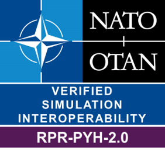

# RPR FOM Physical Module Badge

Interoperability Requirements for the RPR FOM Physical Module. 

| Short&nbsp;Name&nbsp;&nbsp;&nbsp;&nbsp;&nbsp;&nbsp;&nbsp;&nbsp;&nbsp;&nbsp; | Description |
| ---------- | ----------- |
| IR-RPR-PHY-0001 | All of the PhysicalEntity attributes shall be treated as optional fields for federates updating instance attributes of this object class or its subclasses. |
| IR-RPR-PHY-0002 | SuT federates updating instance attributes of one of the PhysicalEntity object classes shall limit use to those object classes indicated by a «Yes» in Table 7 in [SISO-STD-001-2015], when indicated restricted to the enumerators listed. |
| IR-RPR-PHY-0003 | All of the Plattform attributes shown in Table 8 in [SISO-STD-001-2015] shall be treated as optional fields for federates updating instance attributes of this object class or its subclasses. |
| IR-RPR-PHY-0004 | SuT federates updating instance attributes of one of these object classes shall limit use to those object classes indicated by a «yes» in Table 9, when indicated restricted to the enumerators listed. |
| IR-RPR-PHY-1001 | There shall be a collision interaction issued for each object instance involved in a collision. |
| IR-RPR-PHY-1002 | If a SuT detects that one of its entities has struck another entity, it shall issue a collision interaction. |
| IR-RPR-PHY-1003 | If a SuT receives a collision interaction indicating that one of its entities has been struck, it shall issue a response collision interaction, as long as it has not already issued one for the same collision event. |
| IR-RPR-PHY-1004 | Senders of this interaction class shall provide values for all parameters; there are no optional fields. |
