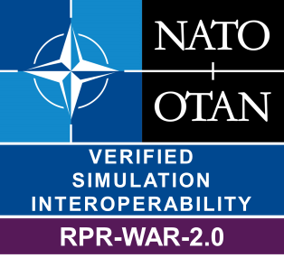

# RPR FOM Warfare Module Badge

Interoperability Requirements for the RPR FOM Warfare Module. 

| Short&nbsp;Name&nbsp;&nbsp;&nbsp;&nbsp;&nbsp;&nbsp;&nbsp;&nbsp;&nbsp;&nbsp; | Description |
| ---------- | ----------- |
| IR-RPR2-0017 | SuT shall define BaseEntity.PhysicalEntity.Munition or at least one leaf object class as published or subscribed in CS/FOM when tracked munitions is used (e.g. torpedoes, missiles, etc.). |
| IR-RPR2-0018 | SuT shall define interaction class WeaponFire or at least one leaf class as published and/or subscribed in CS/SOM. |
| IR-RPR2-0019 | SuT shall provide the following required parameters for the WeaponFire interaction: EventIdentifier, FiringLocation, FiringObjectIdentifier, FuseType, InitialVelocityVector, MunitionType, WarheadType. |
| IR-RPR2-0020 | SuT shall when tracked munition is used provide the WeaponFire parameter MunitionObjectIdentifier. |
| IR-RPR2-0021 | SuT shall provide parameters for sent interactions of WeaponFire and subclasses according to SISO-STD-001-2015 and SISO-STD-001.1-2015. |
| IR-RPR2-0022 | SuT shall assume default values for optional parameters at interactions of WeaponFire and subclasses according to SISO-STD-001-2015. |
| IR-RPR2-0023 | SuT shall not rely on receiving optional parameters on interactions of WeaponFire and subclasses. |
| IR-RPR2-0024 | SuT shall define interaction class MunitionDetonation or at least one leaf class as published and/or subscribed in CS/SOM. |
| IR-RPR2-0025 | SuT shall provide the following required parameters for the MunitionDetonation interaction: DetonationLocation, EventIdentifier, FuseType, MunitionType, WarheadType. |
| IR-RPR2-0026 | SuT shall when munition type is not a mine provide the following required parameters for the MunitionDetonation interaction if: FiringObjectIdentifier, FinalVelocityVector. |
| IR-RPR2-0027 | SuT shall when tracked munition is used provide the MunitionDetonation parameter MunitionObjectIdentifier. |
| IR-RPR2-0028 | SuT shall when the parameter TargetObjectIdentifier at MunitionDetonation is provided, provide the parameter RelativeDetonationLocation. |
| IR-RPR2-0029 | SuT shall provide parameters for sent interactions of MunitionDetonation and subclasses according to SISO-STD-001-2015 and SISO-STD-001.1-2015. |
| IR-RPR2-0030 | SuT shall assume default values for optional parameters on interactions of MunitionDetonation and subclasses according to SISO-STD-001-2015. |
| IR-RPR2-0031 | SuT shall not rely on receiving optional parameters on interactions of MunitionDetonation and subclasses. |
| IR-RPR2-0032 | SuT shall when munition type was not a mine provide the same value on parameter EventIdentifier at the WeaponFire and the corresponding MunitionDetonation interaction. |
| IR-RPR2-0033 | SuT shall when receiving a MunitionDetonation interaction with a specified target (Direct Fire) and SuT has the modelling responsibility for the damage assessment at that entity, update the BaseEntity.PhysicalEntity attribute DamageState with an appropriate value. |
| IR-RPR2-0034 | SuT shall when receiving a MunitionDetonation without a specified target (Indirect Fire) but the same location as an entity and SuT has the modelling responsibility for the damage assessment at that entity, update the BaseEntity.PhysicalEntity attribute DamageState with an appropriate value. |
