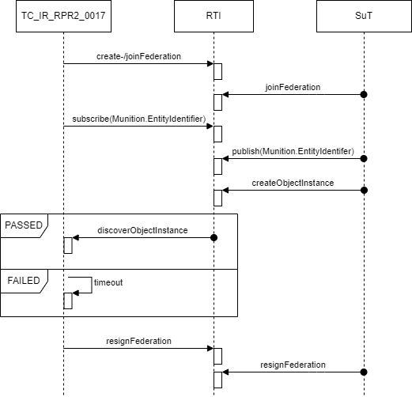
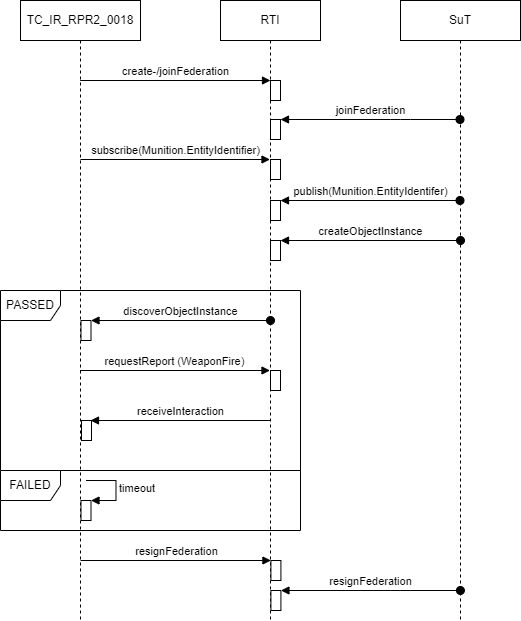

# TestSuite for RPR FOM Warfare Module Badge

This test suite verifies the [Warfare Interoperability Requirements](rpr-warfare.md). 

Interoperability Requirements for the RPR FOM Warfare Module (see also [JSON definition file](badges/RPR-WARFARE-2.0.json)). 

It currently contains the following test cases:

- [TC_IR_RPR_0017](/RPR_Warfare/src/main/java/org/nato/ivct/rpr/warfare/TC_IR_RPR2_0017.java): Current implementation tests if _Munition_ objects are published. Subscription test and verification for tracked munition is missing.

- [TC_IR_RPR_0018](/RPR_Warfare/src/main/java/org/nato/ivct/rpr/warfare/TC_IR_RPR2_0018.java): Current implementation requests MOM reports for interaction subscriptions and publications. Decoding and verification of received reports is missing.

